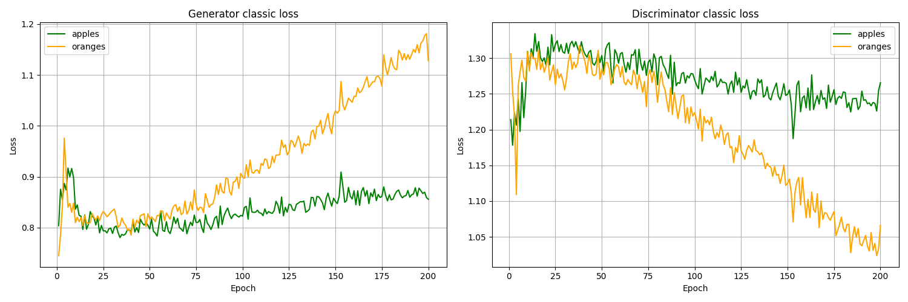
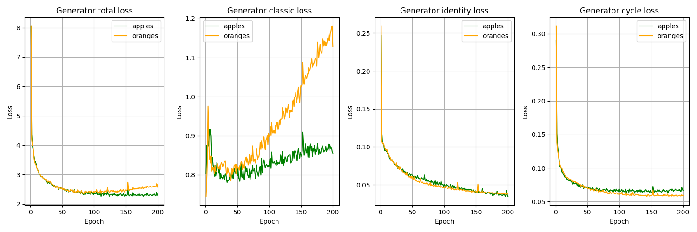
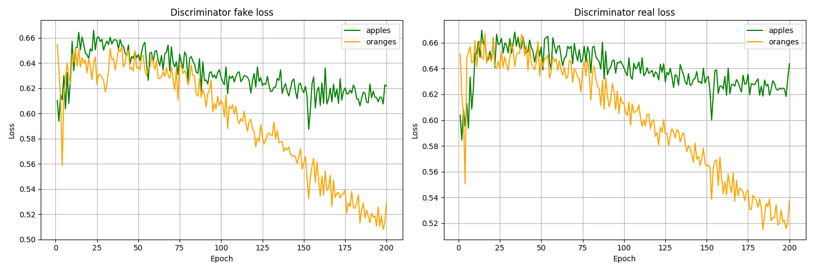
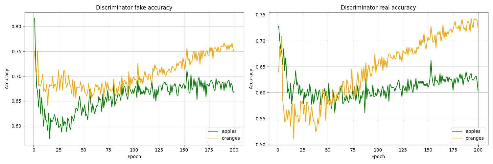

# CycleGAN: Replace apples with oranges and vice versa in images

A [CycleGAN](https://arxiv.org/abs/1703.10593) was implemented and trained in order to replace apples with oranges in images and vice versa.


## Model

### Generator: Apples

```
Model: "generator"
_________________________________________________________________
 Layer (type)                Output Shape              Param #   
=================================================================
 down_sample_layer (DownSam  multiple                  3072      
 pleLayer)                                                       
                                                                 
 down_sample_layer_1 (DownS  multiple                  131328    
 ampleLayer)                                                     
                                                                 
 down_sample_layer_2 (DownS  multiple                  524800    
 ampleLayer)                                                     
                                                                 
 down_sample_layer_3 (DownS  multiple                  2098176   
 ampleLayer)                                                     
                                                                 
 down_sample_layer_4 (DownS  multiple                  4195328   
 ampleLayer)                                                     
                                                                 
 down_sample_layer_5 (DownS  multiple                  4195328   
 ampleLayer)                                                     
                                                                 
 down_sample_layer_6 (DownS  multiple                  4195328   
 ampleLayer)                                                     
                                                                 
 down_sample_layer_7 (DownS  multiple                  4195328   
 ampleLayer)                                                     
                                                                 
 up_sample_layer (UpSampleL  multiple                  4195328   
 ayer)                                                           
                                                                 
 up_sample_layer_1 (UpSampl  multiple                  8389632   
 eLayer)                                                         
                                                                 
 up_sample_layer_2 (UpSampl  multiple                  8389632   
 eLayer)                                                         
                                                                 
 up_sample_layer_3 (UpSampl  multiple                  8389632   
 eLayer)                                                         
                                                                 
 up_sample_layer_4 (UpSampl  multiple                  4194816   
 eLayer)                                                         
                                                                 
 up_sample_layer_5 (UpSampl  multiple                  1048832   
 eLayer)                                                         
                                                                 
 up_sample_layer_6 (UpSampl  multiple                  262272    
 eLayer)                                                         
                                                                 
 conv2d_transpose_7 (Conv2D  multiple                  6147      
 Transpose)                                                      
                                                                 
=================================================================
Total params: 54414987 (207.58 MB)
Trainable params: 54414979 (207.58 MB)
Non-trainable params: 8 (32.00 Byte)
_________________________________________________________________
```

### Generator: Oranges

see *Generator: Apples*

### Discriminator: Apples

```
Model: "discriminator"
_________________________________________________________________
 Layer (type)                Output Shape              Param #   
=================================================================
 down_sample_layer_16 (Down  multiple                  3072      
 SampleLayer)                                                    
                                                                 
 down_sample_layer_17 (Down  multiple                  131328    
 SampleLayer)                                                    
                                                                 
 down_sample_layer_18 (Down  multiple                  524800    
 SampleLayer)                                                    
                                                                 
 conv2d_19 (Conv2D)          multiple                  2097152   
                                                                 
 instance_normalization_30   multiple                  1024      
 (InstanceNormalization)                                         
                                                                 
 leaky_re_lu_19 (LeakyReLU)  multiple                  0         
                                                                 
 zero_padding2d (ZeroPaddin  multiple                  0         
 g2D)                                                            
                                                                 
 conv2d_20 (Conv2D)          multiple                  8193      
                                                                 
=================================================================
Total params: 2765579 (10.55 MB)
Trainable params: 2765569 (10.55 MB)
Non-trainable params: 10 (40.00 Byte)
_________________________________________________________________
```


### Discriminator: Oranges

see *Discriminator: Apples*

## Evaluation

### Loss



### Generator Loss



### Discriminator Loss



### Discriminator Accuracy




### Generated images while training

#### Apples to oranges


#### Oranges to apples


### Generated images

#### Apples to oranges


#### Oranges to apples


